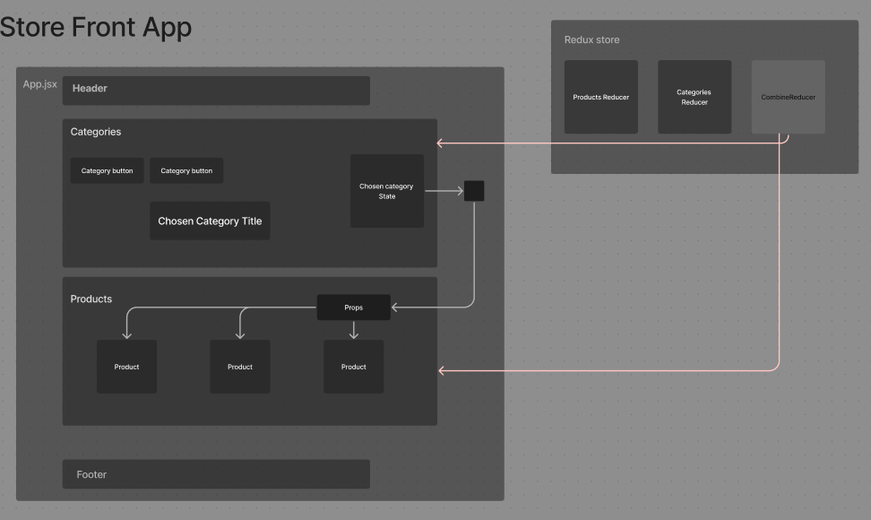
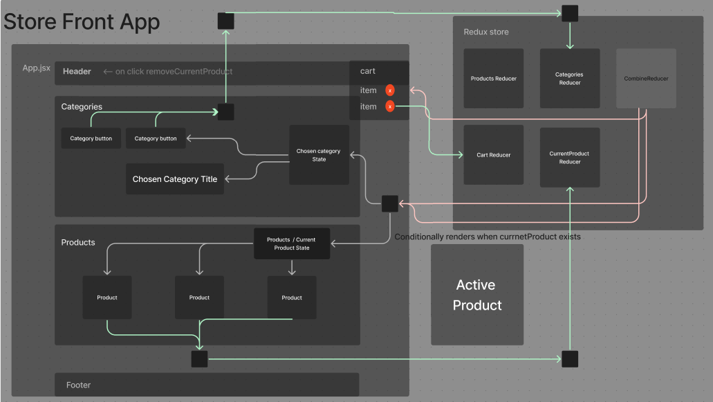

# LAB - Application State with Redux

## Author: Ethan Storm

## Collaboration: Code Fellows Lab

## Links and Resources

[Code sand box](https://codesandbox.io/p/github/ShadowDraco/storefront/main?workspaceId=a3383399-bf2b-4cb1-9efa-c698b2303ac8)

### What is this

4 day LAB build of the **storefront application**, written in React. using React Redux and Material UI.

### Phase 1 Requirements

- As a user, I expect to see a list of available product categories in the store so that I can easily browse products.
- As a user, I want to choose a category and see a list of all available products matching that category.
- As a user, I want a clean, easy to use user interface so that I can shop the online store with confidence.

- Create a visually appealing site using [Material UI](https://material-ui.com/).
- Use a Redux Store to manage the state of categories and items in the store.
- Display a list of categories from state.
- When the user selects (clicks on) a category:
  - Identify that category as selected (change of class/display).
  - Show a list of products associated with the category.

### Phase 2 Requirements

Add the "Add to Cart" feature to our application, which will allow our users to not only browse items in the store, but also select them and have them persist in their "shopping cart" for later purchase.

- As a user, I want to choose from products in the list and add them to my shopping cart.
- As a user, I want to see the products that I've added to my shopping cart in a growing list on the side of the page".
- As a user, I want to change the quantity of items I intend to purchase in the header. i.e. CART (1)
- As a user, I want to be able to remove an item from my shopping cart.

### Phase 3 Requirements

Connecting the Virtual Store to a live API so that data is persistent and able to be separately managed.

- As a user, I want to interact with live inventory so that I have confidence that the displayed products are in stock.
- As a user, I want to know to that when I add an item to my cart, that it is removed from inventory so that no other users can purchase it.

### Application Architecture

Virtual Store application using Vite, Material UI, and React-redux:

- A `<Header />` component which shows the name of your virtual store.
- A `<Footer />` component which shows your copyright and contact information.
- A `<Categories />` component:
  - Shows a list of all categories.
  - Dispatches an action when one is clicked to "activate" it.
- A `<Products />` component:
  - Displays a list of products associated with the selected category.
- A `<SimpleCart />` component:
  - Displays a short list (title only) of products in the cart.
    This should be present at all times.

### Testing

- Tests are accomplished by using Vitest and react testing library.
